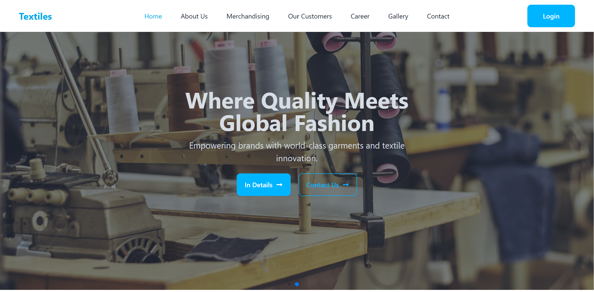
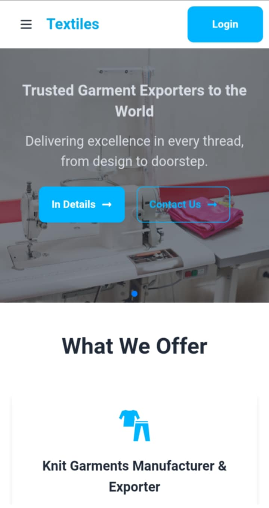

# 🧵 Textiles – Modern Template (Next.js App Router + Tailwind CSS)


A sleek, responsive, and fully customizable modern frontend template focused on textiles and fashion products. Built with **Next.js App Router**, **Tailwind CSS**, and **TypeScript**, it offers a modern UI and smooth user experience for online stores.

---

## 🔗 Live Demo

🌐 [https://textiles.vercel.app](https://textiles.vercel.app)

---

## 🚀 Features

- Built with **Next.js 13+ App Router** for modern routing and layouts
- Written in **TypeScript** for better type safety
- Stylish, responsive UI designed with **Tailwind CSS** and **DaisyUI**
- Smooth **Swiper.js** carousels for product highlights and hero banners
- Clean, modular, and reusable React components inside `app/components/` and `app/(sections)/`
- Fully **responsive** — optimized for all screen sizes
- Custom 404 error page included (`app/not-found.tsx`)
- SEO-friendly with `head.tsx` files for metadata management
- Easy to extend with backend or CMS integrations

---

## 📁 Project Structure (App Router)

textiles/
├── app/
│   ├── layout.tsx            # Root layout
│   ├── page.tsx              # Homepage
│   ├── head.tsx              # Metadata for SEO
│   ├── not-found.tsx         # Custom 404 page
│   ├── (sections)/           # UI sections used in pages
│   └── components/           # Shared reusable components
├── public/                   # Static assets (images, icons, screenshots)
├── styles/                   # Global styles & Tailwind config
├── data/                     # Placeholder data (products, banners)
├── README.md                 # Project documentation
├── package.json              # Project configuration & dependencies

---

## 💻 Getting Started

### Prerequisites

- Node.js (v16+ recommended)
- npm or yarn package manager

### Installation

1. Clone the repo:

```bash
git clone https://github.com/rhshuvo44/textiles.git
cd textiles
````

2. Install dependencies:

```bash
npm install
# or
yarn install
```

3. Run the development server:

```bash
npm run dev
# or
yarn dev
```

Open [http://localhost:3000](http://localhost:3000) to view locally.

---

## 🛠 Build & Production

To build and run the app in production mode:

```bash
npm run build
npm run start
```

---

## 🌐 Deployment

Easily deploy on platforms supporting Next.js 13 App Router:

* **Vercel** (recommended)
* **Netlify**
* Custom Node.js hosts supporting SSR

### Deploy to Vercel

* Connect your GitHub repo to [vercel.com](https://vercel.com/)
* Build command: `npm run build`
* Output directory: `.next`
* Framework preset: **Next.js**
* Deploy!

---

## 🎨 Customization

* Modify UI sections in `app/(sections)/`
* Update or add React components in `app/components/`
* Change page layouts or metadata in `app/layout.tsx` and `app/head.tsx`
* Replace static data in `/data/` or connect a backend API

---

## 📦 Dependencies & Libraries

| Package                                                   | Purpose                         |
| --------------------------------------------------------- | ------------------------------- |
| [Next.js](https://nextjs.org)                             | React framework with App Router |
| [React](https://reactjs.org)                              | UI Library                      |
| [TypeScript](https://www.typescriptlang.org)              | Type safety                     |
| [Tailwind CSS](https://tailwindcss.com)                   | Utility-first CSS framework     |
| [DaisyUI](https://daisyui.com)                            | Tailwind CSS component library  |
| [Swiper.js](https://swiperjs.com)                         | Carousel/slider                 |
| [React Icons](https://react-icons.github.io/react-icons/) | Icon library                    |

---

## 📸 Screenshots

### Homepage Hero Section



### Mobile Responsive View



---

## 📝 Placeholder Notice

> Demo content (texts, images, products) are placeholders for demonstration only and should be replaced with your own content or connected to a CMS/backend.

---

## 📄 Versioning & Changelog

### Version `v1.0.0` – 04 August 2025

* Initial release using Next.js 13 App Router
* Responsive layout with Swiper carousel and modular components

---

## 📄 License & Usage

* Intended for sale and distribution on ThemeForest.
* Free to customize and use in your projects after purchase.
* Redistribution or resale without permission is prohibited.
* Keep author credits where applicable.

---

## 📞 Support & Contact

* Email: [rhshuvo44@gmail.com](mailto:rhshuvo44@gmail.com)
* Portfolio: [ripon.vercel.app](https://ripon.vercel.app)

---

> Thanks for choosing **Textiles**! We hope this template helps you create stunning online stores with ease.

